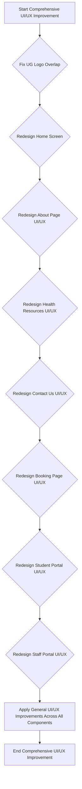

## 1. Product Overview
This document outlines the requirements for a comprehensive UI/UX overhaul of the web application, focusing on enhancing visual appeal, improving user experience across all key pages, and resolving critical layout issues.

- Brief description of main purposes, problems to solve, target users
    - **Main purposes:** Achieve a professional, modern, and intuitive user interface and experience across the entire web application.
    - **Problems to solve:** Inconsistent design, unoptimized layouts, poor visual aesthetics, a recurring logo overlap issue in the header, and general UI/UX dissatisfaction across various pages.
    - **Target users:** All user types including public visitors (Home, About, Health Resources, Contact Us, Booking), students (Student Portal), and staff (Staff Portal).
- Target or market value of the product
    - Significantly enhance user satisfaction, improve brand perception, increase user engagement, and provide a seamless and efficient experience for all user groups.

## 2. Core Features

### 2.1 User Roles
| Role | Registration Method | Core Permissions |
|---|---|---|
| General User | N/A | Browse public pages (Home, About, Health Resources, Contact Us), utilize Booking functionality. |
| Student User | Login with credentials | Access and interact with the Student Portal. |
| Staff User | Login with credentials | Access and interact with the Staff Portal. |

### 2.2 Feature Module
1.  **Global UI Elements**: Header (including Logo), Footer, Navigation, overall page structure.
2.  **Public Pages**: Home, About, Health Resources, Contact Us, Booking.
3.  **Student Portal**: All pages and functionalities within the student portal.
4.  **Staff Portal**: All pages and functionalities within the staff portal.

### 2.3 Page Details
| Page Name | Module Name | Feature description |
|---|---|---|
| All Pages | Header/Logo | **Critical**: Fix the UG logo overlapping the header field issue. Ensure logo is consistently aligned, sized, and does not overlap other elements on any page, across all device sizes. |
| All Pages | General UI/UX | Comprehensive design improvement across all components: typography, color schemes, spacing, responsiveness, iconography, and overall visual aesthetics. |
| Home Screen | UI/UX | Redesign to be more engaging, informative, and visually appealing. |
| About Page | UI/UX | Improve layout, content presentation, and overall visual appeal. Ensure consistent button styling and professional hover effects (especially for "Contact Us" and "Our Services" buttons). |
| Health Resources | UI/UX | Enhance readability, content organization, and visual presentation of health information. |
| Contact Us | UI/UX | Improve form design, clarity of information, and overall user experience. |
| Booking Page | UI/UX | Streamline the booking process, improve visual feedback, and ensure an intuitive user flow. |
| Student Portal | UI/UX | Complete redesign to enhance usability, visual appeal, and efficiency for student users. |
| Staff Portal | UI/UX | Further redesign to enhance usability, visual appeal, and efficiency for staff users, building upon previous improvements. |

## 3. Core Process
- User navigates through the application, interacts with various public and authenticated pages.
- Specific attention to the header area to ensure no logo overlap.
- Focus on consistent, modern UI/UX principles across all designated pages.

## 4. User Interface Design
### 4.1 Design Style
- Primary and secondary colors: Establish a fresh, cohesive, and professional color palette that aligns with the institution's brand.
- Typography: Select modern, legible, and aesthetically pleasing font families for headings and body text, ensuring proper hierarchy and readability.
- Button style: Consistent, modern, and accessible buttons with clear states (hover, active, disabled) across the entire application.
- Layout style: Clean, organized, and intuitive layouts that prioritize content and user flow, adapting well to various screen sizes.
- Iconography: Use a consistent, high-quality icon set that enhances usability and visual appeal.

### 4.2 Page Design Overview
| Page Name | Module Name | UI Elements |
|---|---|---|
| All Pages | Header | Correctly positioned and sized UG Logo, streamlined navigation, responsive behavior. |
| All Pages | General | Consistent application of chosen typography, color palette, spacing, and responsive design principles. |
| Home Screen | Hero Section | Engaging visuals, clear call-to-actions. |
| About Page | Content Layout | Improved readability, better integration of media, clear button hierarchy. |
| Health Resources | Article Display | Clean layout for articles, easy navigation, relevant imagery. |
| Contact Us | Form Elements | Intuitive form fields, clear labels, validation feedback, accessible design. |
| Booking Page | Step-by-Step Flow | Clear progression indicators, accessible date/time pickers, summary views. |
| Student Portal | Dashboard/Navigation | Personalized content, easy access to key features, modern data presentation. |
| Staff Portal | Dashboard/Navigation | Efficient workflows, clear data visualization, consistent component library. |

### 4.3 Responsiveness
Implement a mobile-first design approach to ensure optimal user experience across all devices, from mobile phones to large desktop displays.