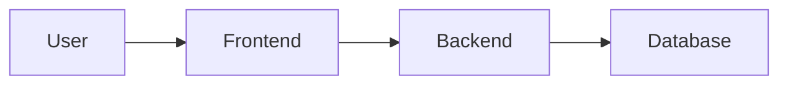

## 1. Architecture Design

## 2. Technology Description
- Frontend: Next.js (React@18) + Tailwind CSS@3.
- Key Libraries: NextAuth.js for authentication, Zustand for state management, likely `lucide-react` for icons.
- Initialization Tool: Existing project structure will be maintained and enhanced.

## 3. Route Definitions
| Route | Purpose |
|---|---|
| / | Home page |
| /about | Information about the organization |
| /health-resources | Educational health content |
| /contact | Contact form and information |
| /booking | Appointment booking process |
| /student-portal | Entry point for student users |
| /staff-portal | Entry point for staff members |
| /login, /register, etc. | Authentication routes |

## 4. API Definitions
N/A - This task primarily focuses on frontend UI/UX. Existing APIs will be consumed as-is.

## 5. Server Architecture Diagram
N/A - This task primarily focuses on frontend UI/UX.

## 6. Data Model
N/A - This task primarily focuses on frontend UI/UX.